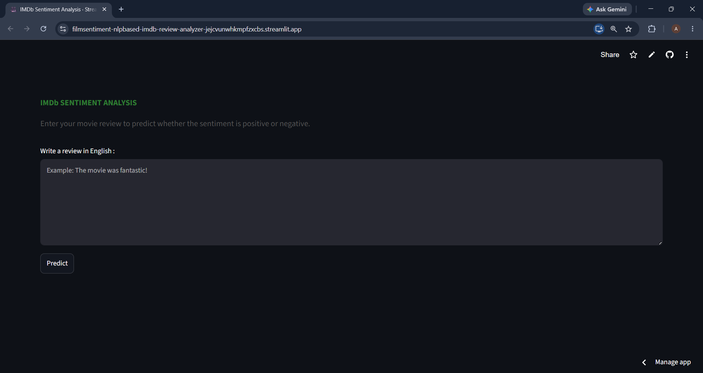
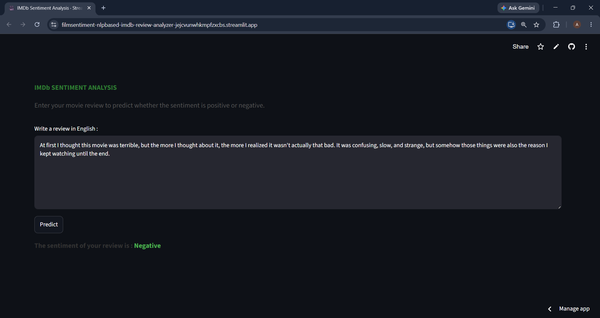
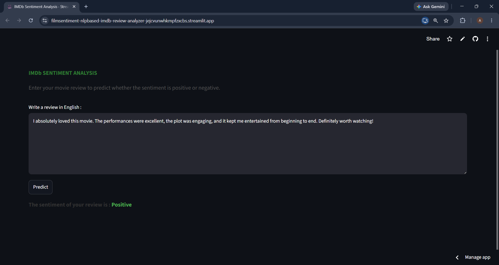

# 🎬 IMDb Sentiment Analysis Using Machine Learning

A machine learning web application that predicts the sentiment of movie reviews from IMDb dataset.  
The application classifies reviews into **Positive** or **Negative** sentiment using Natural Language Processing (NLP) and a trained machine learning model.

## Dataset
```bash
https://www.kaggle.com/datasets/lakshmi25npathi/imdb-dataset-of-50k-movie-reviews
```

## 🚀 Features

- Predict movie review sentiment (Positive / Negative)
- Text preprocessing using NLP techniques
- TF-IDF text feature extraction
- Interactive web interface using Streamlit
- Simple and user-friendly review input

## 🛠️ Technologies Used

- Python
- Streamlit
- NLTK
- Scikit-learn
- TF-IDF Vectorizer
- Machine Learning
- Pickle

## 🔤 NLP Processing

The review text goes through several preprocessing steps :
- Convert text to lowercase
- Remove non-alphabet characters
- Tokenization
- Remove stopwords
- Lemmatization

## 📊 Input

The model accepts :
- English movie review text

Example:
```text
The movie was great ! I love this kind of movie.
```

Prediction Output:

```text
Sentiment: Positive
```

## 📂 Project Structure

```
│

└── screenshots/
    └── app.png
    └── negative_sentiment.png
    └── positive_sentiment.png
├── app.py
├── sentiment_model.pkl
├── vectorizer.pkl
├── README.md
└── requirements.txt
```

## ▶️ How to Run

### 1. Clone this repository
```bash
git clone https://github.com/sianesantoso/FilmSentiment-NLP_Based-IMDb-Review-Analyzer.git
```

### 2. Install dependencies
```bash
pip install -r requirements.txt
```

### 3. Run Streamlit application
```bash
streamlit run app.py
```

## 🎯 Prediction Output 

The application will display : 
- Positive → if the review has a positive sentiment
- Negative → if the review has a negative sentiment

## Web Preview
```### Main Page


### Prediction Result


```

## 📄 License 

This project is for educational and portfolio purposes.
